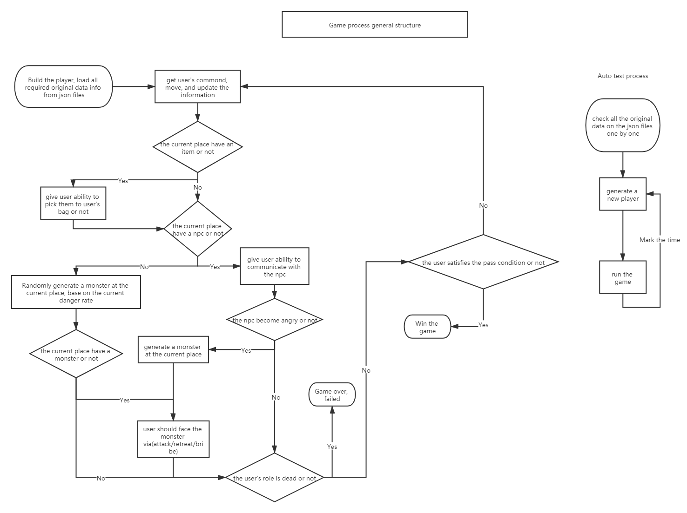

[[_TOC_]]

## Welcome to the wiki:

[Reference and additional library required](/Reference and additional library.md)

[Application of knowledge in this course](/Application of knowledge in this course.md)

## For game players:

[Quick guide](/Quick_Guide.md)

## For game designers:

[How to design a game](/How_to_design_game.md)

[How to test the game](/How_to_test_game.md)

## For game engine developer

[Our game engine design. (Design documents)](/How_to_develop_game_engine.md)

## How the game operates:

