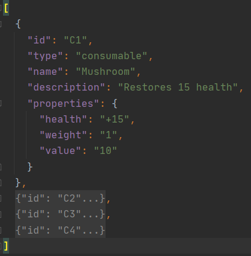
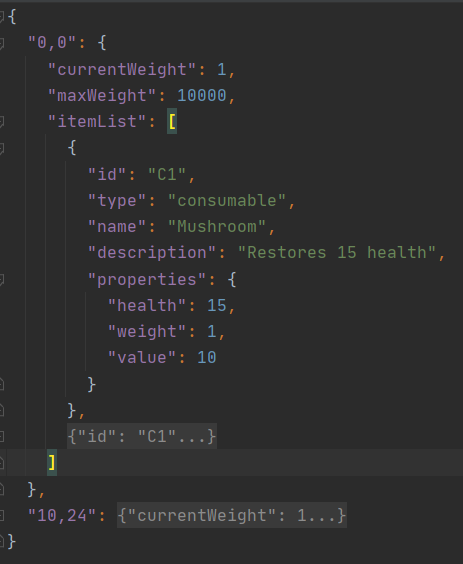
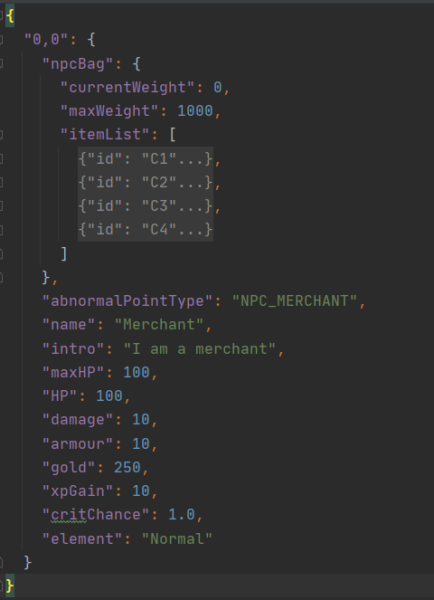
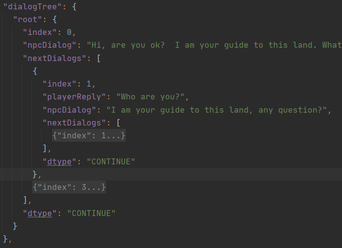
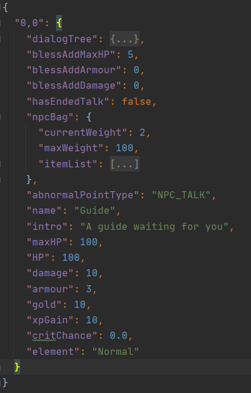

**Mainly, the game designer can write / modify the 5 json files in json_files/original_data to design the game.**

- **ItemBook.json**: All the legal items in the game. Which should have:
  - "id":(string)
  - "type":"consumable"(may be other types in the future game engine development)
  - "name":(string)
  - "description":(string)
  - "properties":
    - "health":(int)
    - "weight":(int)
    - "value":(int) 
  - Example:
    - 

- **InitializedItem.json**: All the items in the game map. Which should have:
  - coordinate("0-30, 0-30"): where is the special position
    - "currentWeight":(int)
    - "maxWeight":(int)
    - "itemList": a list of items stored in the ItemBook.json
  - Example:
    - 

- **Player_original_attributes.json**: Description of how the player's original stats and what happens if upgrade.
  - Example:
    - "maxHPIncreasePerLv": 15
    - "armorIncreasePerLv": 5
    - "damageIncreasePerLv": 2
    - "criticalChanceIncreasePerLv": 0.02
    - "initRandomMaxHP": 30
    - "initBaseMaxHP": 120
    - "initRandomMoney": 5
    - "initBaseMoney": 10
    - "initMaxXP": 10
    - "initXPPerLv": 10
    - "initRandomArmor": 4
    - "initBaseArmor": 4
    - "initRandomDamage": 8
    - "initBaseDamage": 12
    - "initCriticalChance": 0.02
    - "initMaxCriticalChance": 1.0
    - "initBagWeight": 10
    - "initXCoordinate": 0
    - "initYCoordinate": 0

- **MerchantNPC.json**：
  - coordinate("0-30, 0-30"): where is the npc
    - "npcBag": what the merchant has
      - "currentWeight"(int)
      - "maxWeight"(int)
      - "itemList": a list of items stored in the ItemBook.json
    - "abnormalPointType":"NPC_MERCHANT"
    - "name":(string)
    - "intro":(string)
    - "maxHP":(int)
    - "HP":(int)
    - "damage":(int)
    - "armour":(int)
    - "gold":(int)
    - "xpGain":(int)
    - "critChance":(int)
    - "element":"Normal"
  - Example: 
    - 

- **TalkNPC.json**:
  - A coordinate determines where the npc is:
    - npc must have the following characteristics: 
      - diagtree: must have the characteristic:
        - root: must have:
          - index:(int)
          - npcdialog:(string)
          - nextdialogs(): If it is not empty: 
            - must follow the similar structure with root:
            - playerReply:(string):potential added characteristic
        - Example:
          - 
      - blessaddmaxhp:(positive integer)
      - blessaddarmour:(int)
      - blessadddamage:(positive integer)
      - hasendedtalk:(Boolean)
      - abnormalpointtype:"NPC_Talk"
      - name:(string)
      - Intro:(string)
      - maxhp:(positive integer)
      - HP:(positive integer),
      - damage:(positive integer)
      - armour:(int)
      - gold:(int)
      - xpgain:(int)
      - critchance:(double from 0-1)
      - element:(must be "normal")
    - possible characteristic: 
      - npcbag: same as what in MerchantNPC
  - Example:
    - 
  
