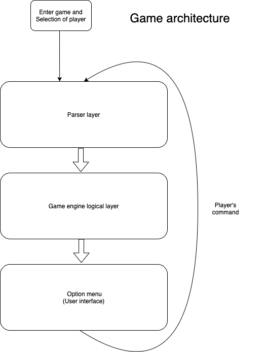

## **Design Document**:
**Game engine structure**

-----
**Parser**

- Located inside the CommandParser package, in charge of parsing the user's command and calling corresponding functions inside the game engine logical layer.  It is constructed by three classes: Token,  CommandTokenizer and Parser.  Token, is a subclass, declaring the keyword (_user input string_) by an identifier enum Type.  CommandTokenizer implements the Tokenizer interface.  Its main function is to identify the player's input, attach Token type to the input, and create it as Token named currentToken.  Most of the commands that are identified by its type have at most two words, except item, which may have an unknown number of words.  The matching of command is first created into a word (_stringbuilder_) that is separate by space and matches the word by preset string with if else statements.  This allows multiple words to be identified into the same token type, which enhances the flexibility of command choice of words.  Item type is identified by increment reading of input word, which will go through all the words inside the user input command and compare the name inside the item book by ‘isItem’.  Parser uses Token type identified by CommandTokenizer and call methods controlling the player based on the construction (_grammar_) of token type inside the player’s command input.  The grammar is designed with Backus-Naur form, mainly in the simple form of <verb> <noun> or just <noun>.  The grammar design of this game can be viewed inside the Parser class.  The overall effect is a close to natural language command parser that works well with user interaction.

-----
**Menu**

- The Option Menu is an interactive user interface that can get input from user and print out corresponding information to user. Option Menu can work together with Parser in order to comprehensively recognise various input strings from user. There are different option menus for various situations. For example, there are ordinary options (_NormalOption.java_); starting options (_StartOption.java_); load-player options (_PlayerOPtion.java_); battle options (_BattleOption.java_);  NPC options (_NpcOption.java_) and multiple-NPC options (_NMOption.java_).

_**How Option Menu constructed**_
- The basic option menu is BasicOption.java, all other advanced option menus will extend this class. The reason they are constructed in this way is that all of the different option menus have some comment part and they are all able to fulfill some basic functionalities that menus should provide to user. Hence, if there is a fundamental class that can hold all these functions, it will be tidier and more convenient for managing all option menus.

_**A option menu is arranged by three parts:**_
- Firstly, buildMenu() method will add a series of command names to a list, called option. This list provides all printable information to the menu.  
- Secondly, the menu will print out command name and description to console, some other types of menu will print out different information rather than command instruction. For example, PlayerOPtion.java can print out saved player names from Json files; NMOption.java can print out names of monsters and NPCs which are in the current coordinate.  
- Lastly, the menu will take input from the player after it prints out information, this input will be considered as the choice that indicates which step player wants to go next. Hence, when the menu reads this input, it can give it back to program and display the corresponding information.

----
**Game Logic Layer**
----

_**Abnormal points**_

**Entity**

- An abstract class that declares basic stat attributes for all monsters and NPC.  For example, name, intro, HP, damage, gold etc.  Both NPC and monster are children classes of entity, and enable them to be attacked by players. The element characteristic stored in it (_Default: normal_) can be used to enhance the complexity of attack function in future development. (_Mutual restriction of entity types_)
**Abnormal point**
A class that enables storing of varias children classes inside a same array list.  While the identifying of an element's type is by the attribute ‘AbnormalPointType’, containing Monster, NPC Talk and NPC merchant.
------------------------------------------------------------------------------------
**Monster**

- A class extends from entity class that will generate a monster with attributes based on the player 's current level.  Assisted by the MonsterAttributes class.  MonsterAttributes is to create monsters in an easier and more abstract way.  Further improvement can be done by storing monster attributes inside the json, and load when needed.
------------------------------------------------------------------------------------
**NPC TALK**

- A class that enables player conservation with npc that will lead to different outcomes based on the npc’s designed dialog tree. It extends from entity and abnormal point classes and has more attributes such as dialog tree that develop conversation, blessing attributes which indicate how much stat a player can permanent increase upon receiving the npc bless, a bag to store items that a npc may give to player, and a boolean hasEndedTalk to determine whether a npc has already talked to the player.  
------------------------------------------------------------------------------------
**Dialog Tree**

- Dialog tree is a tree structure that has taken inspiration from a B-Tree.  However, it does not have dynamic insert and load operations.  All modification requires manual insertion and deletion inside the corresponding json files.  Every root node of the Dialog tree represents the current conversation node which the player is at, and the root’s children node represents the option which the player may choose.  The leaves of the Dialog tree should have dialog type that begins with name ‘END’(_See more in DialogType_), and the various end dialog type enables varias conversation results, which enable much more game plot possibility.  For example, a npc can give gold or items to you if you act nice, but attack you if you act rude.
------------------------------------------------------------------------------------
**NPC MERCHANT**(_Shopping system_)

- Enable the player to purchase helpful items in the game from the merchant on the map. Also handle internal logic behind the trade. For instance, put the purchased item in the bag, lose the corresponding money as specified in the value property of the item the player just purchased. 
------------------------------------------------------------------------------------
**Bag**

- Bag is attached to each player as storage. Player’s bag has an upper limit. This enables the player to pick items from the map into the bag and drop items out of the bag as required. 
------------------------------------------------------------------------------------
**Item**

- This enables the player to use various items with various effects. Game creator is able to edit the json file to create a DIY Item.
------------------------------------------------------------------------------------
**Navigation**

- The navigation package shows how the navigation system works in this project.  It is a 2D map, described by coordinate x,y.  Player’s directional movement contains North, East, South, West, where choosing one of the directions will move the player to the next coordinate inside the map.  This design allows the player to move freely inside the map, without constraint of linking rooms.
------------------------------------------------------------------------------------
**Place**

- This class is used for storing the current abnormal points (_special event etc._) and the current position the player is at. It operates like a transmitter to exchange map data (_designed by game designer pre-stored in json files, and stored in player’s 3 hashmap_) to functions and get operated data by them.
------------------------------------------------------------------------------------
**Player**

- Player class summarizes the game engine logical information, and it is the character which the user controls inside the game.  Most of the methods inside this class primarily serve the role of responding to the call from Parser.  For example, attack() which attacks a monster, goToDirection which moves the player to the next coordinate and talk() which enables the player to temporarily open a dialog window to chat with an NPC.  Player’s initial stat is randomly generated based on the player statistic provided by PlayerAttribute.json.  A player profile contains not only the player’s statistics or bag, but also the game map information that holds all the player's progress of exploration through use of hashmap.  This makes sures that items or npc inside a coordinate is non refreshable once being interacted by the player.
------------------------------------------------------------------------------------
_**Suggestion on further development**_
------------------------------------------------------------------------------------
**Gui part**

- Designed to give the user a better looking operation interface. (_To be continued_)
The card system
Designed as the extension of the item system. For enhance the playability of the game. (_To be continued_)
------------------------------------------------------------------------------------
**The map system**

- Designed for the extension of the playability of the game. (Outside multiple npcs and monsters, the game world can be described as ocean, forest, city, etc. , having different type of special events to play) (To be continued)
------------------------------------------------------------------------------------
**The item system**

- Enabling more property of items, such as throwing items at monsters will reduce health prior to attack.  The adding of property should also modify the Parser to enable more command and add methods inside player to respond to the method call.
------------------------------------------------------------------------------------
_**About Json**_
------------------------------------------------------------------------------------
**Why do we use json?**

- Json as a persistent data storage format with simple grammar and light weight has been really helpful for our game and design. It enables the following functionality:
------------------------------------------------------------------------------------
**How does the game get initialized?**

- The game is initialized by loading all the json files in the original_data file.
Can the initial setting of the game be changed by editing the corresponding json file?
As a result, the player or programmer can change the initial setting of the game by simply editing the corresponding json file.
------------------------------------------------------------------------------------
**How to load the game and save the game?**

- The game is saved by just converting the player into a json object, stored in a json file. And the game is loaded by extracting corresponding game content(_e.g. which coordinate the npc is at_) from that object(_restore it from the json file_) manually

