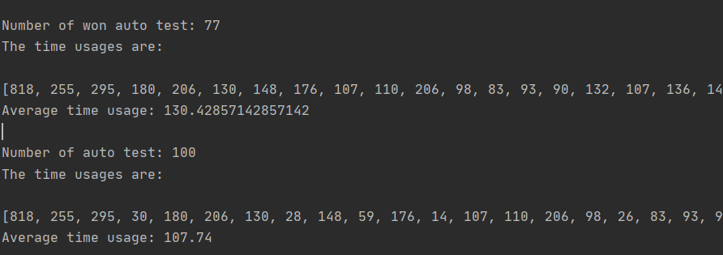

**to operate the autotest, you need to add fastjson-1.2.75(from alibaba/which is in the wiki package as well) to your lib**

- Stage 1: Run JsonTestNpcTalk.java (and the other four) to verify that if the game script meets the requirements of the game engine. It will tell you what the first illegal data is and why.
- Stage 2: Run the autoTest.java to check game balance and bugs.
  - If no bugs, it will show you the number of won auto test (with their time usage -ms) and the number of auto test (with their time usage -ms)
- demo about the usage of auto test stage 1: 
  - 
- sample result of auto test stage 2: 
  - 